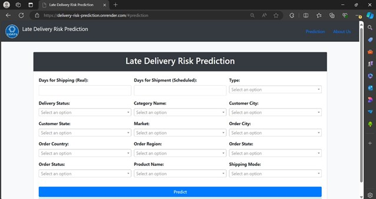
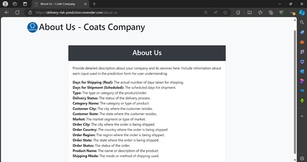
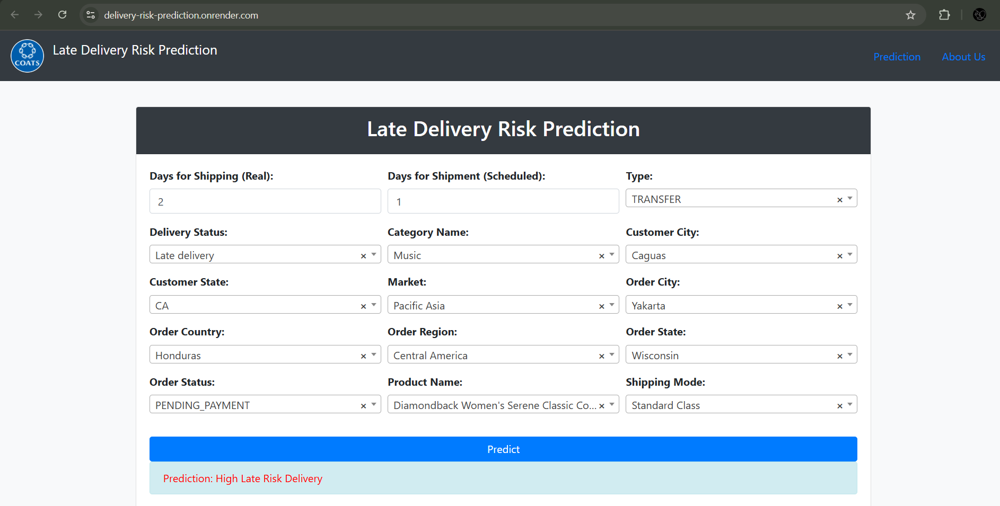

# Supply Chain – Late Delivery Risk Predictor

## Overview
This project develops a predictive model to identify supply chain orders at high risk of being delivered late. By analyzing various attributes of the dataset, the model helps supply chain managers anticipate delays and take proactive measures. The final solution is deployed as a Flask-based web application with both a user interface and a REST API.

## Objectives
- Build a predictive model to identify the risk of late deliveries.
- Analyze features to understand key factors behind delays.
- Create a Flask web application for interacting with the model.

## Dataset
The dataset consists of order, customer, product, and shipping details. The target variable is `late_delivery_risk` (0 = On Time, 1 = Late).

Examples of attributes used:
- Days for shipping (real)
- Days for shipment (scheduled)
- Delivery Status
- Order Status
- Shipping Mode
- Category Name, Customer City, Market, Product Name

## Tech Stack
- Languages and Libraries: Python, scikit-learn, pandas, matplotlib, seaborn
- Machine Learning Models: Logistic Regression, Naive Bayes, KNN, XGBoost, AdaBoost, Decision Tree (final model)
- Preprocessing: category_encoders (TargetEncoder, LabelEncoder), SelectKBest (chi2), MinMaxScaler
- Frameworks: Flask, Jinja2
- Frontend: HTML, CSS, JavaScript
- Deployment: Render
- Utilities: joblib for model persistence

## Key Features
- Cleaned and preprocessed dataset (~180K rows, 52 attributes).
- Automated ML pipeline with encoding, scaling, and feature selection.
- Compared six ML models; selected Decision Tree for deployment based on evaluation metrics.
- Flask application with HTML templates for input and output (index.html, result.html, error.html, about_us.html).
- REST API endpoint (/predict) providing JSON output.
- Deployed on Render for live access.
- 
## Screenshots

### Prediction Page


### About Us Page


### Result Page



## Setup Instructions
1. Clone the repository:
    ```bash
    git clone https://github.com/22ad085/Supply-Chain-Management-.git
    ```
2. Navigate to the project directory:
    ```bash
    cd Supply-Chain-Management-
    ```
3. Install the required dependencies:
    ```bash
    pip install -r requirements.txt
    ```
4. Run the Flask application:
    ```bash
    python app.py
    ```

## Model Training and Evaluation
- Various machine learning models were evaluated, including Logistic Regression, Naive Bayes, XGBoost, AdaBoost, KNN, and Decision Tree.
- The dataset was split into training and testing sets using an 80-20 split.
- Label encoding and target encoding were implemented for categorical features.
- The Decision Tree model was selected for final deployment based on its high AUC score and balanced precision-recall trade-off.

## Web Interface
The web application's user interface is designed using four HTML templates: `index.html`, `result.html`, `error.html`, and `about_us.html`, with Flask serving as the framework to manage the backend functionality.

## Expected Outcomes
- A cleaned and preprocessed dataset ready for model training.
- A report detailing the exploratory data analysis and feature engineering steps.
- A trained predictive model with comprehensive evaluation metrics.
- Practical insights and recommendations aimed to improve supply chain productivity.
- A robust and reliable late delivery risk prediction model with a web interface.

## Contributors
- ThangaMuthuMari Preethi M (Ramco Institute of Technology)
- Karthika Lakshmi (Ramco Institute of Technology)
- Keerthana Devi M (Thiagarajar College of Engineering)

## License
This project is licensed under the MIT License - see the [LICENSE](LICENSE) file for details.
